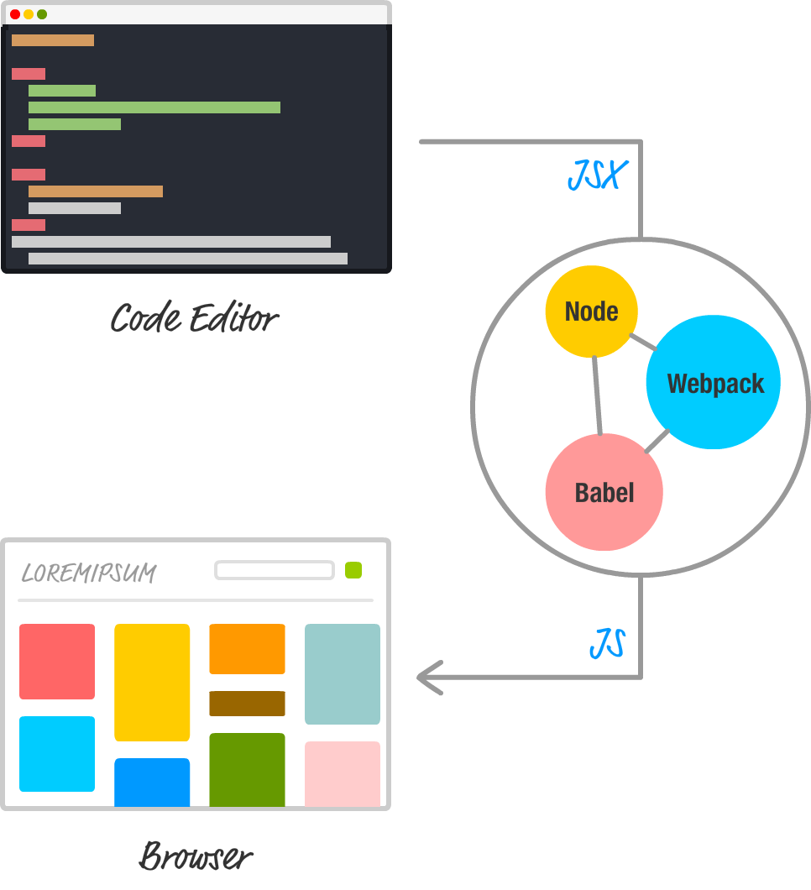

# React 开发环境

在前面的 Demo 中，我们都是通过包含几个 JS 文件来创建 React 应用的：
```
<script src="../lib/react.js"></script>
<script src="../lib/react-dom.js"></script>
<script src="../lib/browser.min.js"></script>
```

头两个脚本文件用于加载 React 库，最后一个脚本文件用于加载 Babel， 帮助浏览器将 JSX 转换为 JavaScript。

这种方法的负面是性能。因为浏览器除了要加载页面以外，还得把 JSX 转换为实际的 JavaScript。这个转换过程很耗时，最好是在开发期间就转换了。

解决方案是设置开发环境，让 JSX 到 JS 的转换作为应用程序构建的一个部分来处理：



设置 React 开发环境，我们需要用到 Node.JS、Babel、Webpack 以及一款编辑器作为开发工具。


## 1.初始化 node 环境
```
npm init
```

控制台会输出一堆问题，帮助设置项目上的 Node.js。完成初始化后，根目录下会生成 `package.json` 文件，其内容如下：
```
{
    "name": "react-demo",
    "version": "1.0.0",
    "description": "React Demo",
    "main": "index.js",
    "scripts": {
        "test": "echo \"Error: no test specified\" && exit 1"
    },
    "author": "guihua.pgh",
    "license": "MIT"
}
```


## 2.安装相关依赖
首先安装 React 依赖：
```
tnpm ii react react-dom --save-dev
```

完成安装后，会在根目录下生成 `node_modules` 目录，其中保存了安装的 React 和 React-DOM 库。

其次，安装 `webpack` 工具：
```
tnpm ii webpack --save-dev
```

安装完成后，配置 `webpack.config.js` 文件：
```
module.exports = {
    entry: './entry.js',
    output: {
        path: __dirname,
        filename: 'bundle.js'
    },
    resolve: {
        extensions: ['', '.js', '.jsx']
    },
    module: {
        loaders: [{
            test: /\.js$/,
            loaders: ['jsx?harmony']
        }, {
            test: /\.scss$/,
            loader: "style!css"
        }]
    }
}
```

最后，安装 `babel` 依赖：
```
tnpm ii babel-loader babel-preset-es2015 babel-preset-react --save
```

安装完成后，需要配置 `Babel` 与项目一起工作。这个需要两个步骤。

第一步，在 `package.json` 中指定要用哪个 `Babel` 预置：
```
"babel": {
    "presets": [
        "es2015",
        "react"
    ]
}
```

第二步是让 `webpack` 知道 `Babel`。在 `webpack.config.js` 文件中，添加如下代码：
```
module: {
    loaders: [{
        include: DEV,
        loader: "babel"
    }]
}
```

全部安装完成后，`package.json` 文件中的依赖如下：
```
"devDependencies": {
    "react": "^15.4.1",
    "react-dom": "^15.4.1",
    "babel-core": "^6.18.2",
    "babel-loader": "^6.2.8",
    "babel-preset-es2015": "^6.18.0",
    "babel-preset-react": "^6.16.0",
    "webpack": "^1.13.3"
}
```

## 3.执行编译
编译命令：
```
webpack
```

编译成功后，运行 `index.html` 即可。